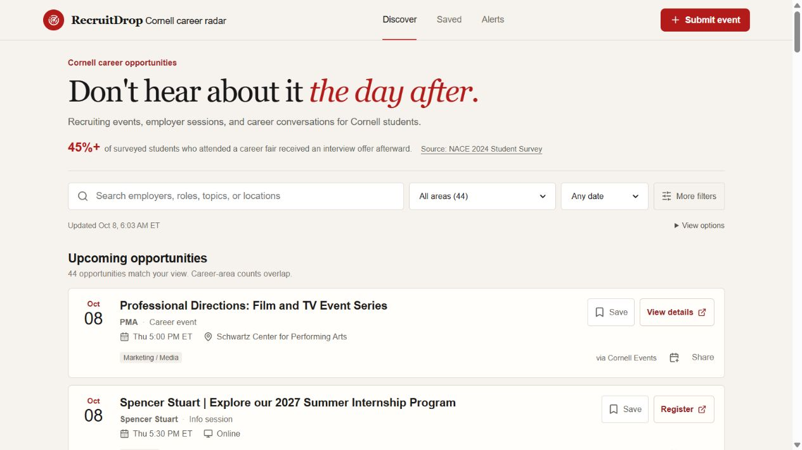

# RecruitDrop

A Cornell-focused feed for recruiting events, information sessions, career fairs, and deadlines. It collects public event data, keeps links to the original sources, and lets students filter the feed, save events on their device, or subscribe through a calendar.

Built with Next.js, TypeScript, PostgreSQL, and Prisma. The interface uses React components and ordinary CSS.



Live event feed captured October 8, 2026, with filters, source links, and calendar actions.

## How events reach the feed

Each source has a configuration record. The ingestion code fetches its pages, extracts event fields, validates them with Zod, normalizes metadata, and compares candidates against existing events before writing to PostgreSQL.

Structured data comes first: Cornell's Localist JSON, supported calendar JSON, and page-level JSON-LD have direct parsers. Gemini is a fallback for public pages without usable structured data. Every run records its outcome, and merged events retain their listing or detail URLs through `EventSource`.

The enabled source registry currently includes Cornell Events and USAJOBS virtual career events. Other adapters remain disabled when a source is unavailable or requires permission. Authenticated Handshake pages are not fetched.

A few details that mattered:

- Deduplication compares events within a three-hour window, rejects conflicting locations, and uses event-detail URLs, registration URLs, or normalized title similarity. Shared listing URLs alone do not identify an event.
- Cornell's distinct-event listing can hide additional sessions. Bounded detail requests recover explicit session dates; all-day placeholders are excluded.
- Career tags use the event's purpose and explicit discipline evidence. Broad biography keywords previously caused over-tagging, so updates recheck retained source evidence rather than accumulating old tags.
- Fetching checks robots policies and redirects, spaces requests, and limits time and response size. Failures are logged per URL so one bad page does not discard the whole run.

Detailed source configuration, deployment, and repair commands are in [the operations notes](docs/operations.md).

## Using the app

The feed supports text search, career-area and event-type filters, date windows, and shareable query parameters. Saved events and a default view use local storage on the current device.

Calendar subscriptions include upcoming published real events with stable IDs. Weekly email alerts use double opt-in through Resend and include an unsubscribe link. Submitted URLs go into a review queue rather than publishing immediately.

With no database configured, the feed shows a labeled sample dataset. Database-backed submissions and ingestion return an unavailable response. Calendar endpoints do not substitute sample events for a failed or empty live feed.

## Run locally

Use Node 22+ and pnpm, and provide a PostgreSQL connection string in `.env`:

```bash
cp .env.example .env
pnpm install
pnpm db:generate
pnpm db:migrate
pnpm db:seed
pnpm dev
```

On PowerShell, use `Copy-Item .env.example .env`. Open `http://localhost:3000`. Seeding inserts labeled sample events and synchronizes the source registry.

To synchronize sources without inserting sample events:

```bash
pnpm db:seed --sources-only
pnpm ingest
```

`GEMINI_API_KEY` is optional for sources handled by direct parsers. For email alerts, configure `APP_URL`, `RESEND_API_KEY`, and `ALERT_FROM_EMAIL` with a verified sender domain. Scheduled endpoints require `CRON_SECRET`; the deployment owns the schedule.

## Checks

```bash
pnpm test
pnpm typecheck
pnpm lint
pnpm build
```

Tests cover source parsing, fetching rules, metadata classification, deduplication, ingestion, feed behavior, and calendars. Source fixtures let parser checks run without depending on a live website.

## What still needs work

Coverage depends on what public sources publish and can miss events or entire career areas. Calendar clients choose their own refresh interval. Saves are device-local; the account-related database models are not an implemented sign-in flow.

Source administration and moderation need authentication before being exposed publicly. The submission limiter is in memory, so it does not coordinate across server instances. RSS and iCalendar responses can be fetched but have no dedicated extractor. This is a student project with bounded ingestion, not a complete recruiting directory.
